# <mark> Secure Private EC2 Access with AWS Systems Manager </mark>

## Project Overview

This hands-on project demonstrates how to securely administer an Amazon EC2 instance located in a Private Subnet using AWS Systems Manager Session Manager without requiring a Public IP address, inbound SSH access, or a Bastion Host.

Unlike the previous Session Manager project, this project focuses on the networking requirements behind Session Manager in a private environment.

The architecture uses VPC Interface Endpoints to provide private connectivity between the EC2 instance and AWS Systems Manager services without requiring general internet access or a NAT Gateway.

## Scenario

A company wants to secure administrative access to an internal EC2 server.
The server contains workloads that should not be directly exposed to the internet. The security team therefore requires the EC2 instance to remain in a Private Subnet without a Public IP or inbound SSH access.

However, administrators still need a reliable way to access the server and perform maintenance tasks. The solution is to use AWS Systems Manager Session Manager with VPC Interface Endpoints.

### The EC2 instance will have:

Public IP        → None  
Inbound SSH      → None  
Bastion Host     → None  
Internet Access  → Not required

### While still providing:

IAM-based access        → Enabled  
SSM Agent               → Running  
Managed Node            → Online  
Session Manager         → Working

## Troubleshooting Scenario

To validate the architecture, a controlled failure is introduced by removing the TCP 443 inbound rule from the Security Group attached to the VPC Interface Endpoints.

The expected effect is:

```
Private EC2  
      ↓  
HTTPS / TCP 443  
      ✕  
VPC Interface Endpoint
```
The Session Manager connection then fails.

The issue is investigated by checking:

- IAM Role and permissions
- Systems Manager interface endpoints
- Endpoint Security Group
- TCP 443 connectivity

The root cause is identified as the missing HTTPS/443 rule on the endpoint Security Group.  
After restoring the rule, a new Session Manager session is successfully established.  
This demonstrates how network-level controls can affect Systems Manager connectivity even when the EC2 instance is still shown as an online managed node.

---

# AWS Services

The following AWS services and features are used in this project:

| Service / Feature       | Purpose                                           |
| ----------------------- | ------------------------------------------------- |
| Amazon VPC              | Provides the isolated network environment         |
| Private Subnet          | Hosts the private EC2 instance                    |
| Route Tables            | Control subnet traffic routing                    |
| Amazon EC2              | Private server being administered                 |
| AWS IAM                 | Controls EC2 Systems Manager permissions          |
| AWS Systems Manager     | Provides centralized instance management          |
| Session Manager         | Provides interactive shell access                 |
| VPC Interface Endpoints | Provide private connectivity to Systems Manager   |
| Security Groups         | Control traffic to the EC2 instance and endpoints |

---

# Architecture

The final architecture uses a private EC2 instance with no Public IP and no inbound SSH access.

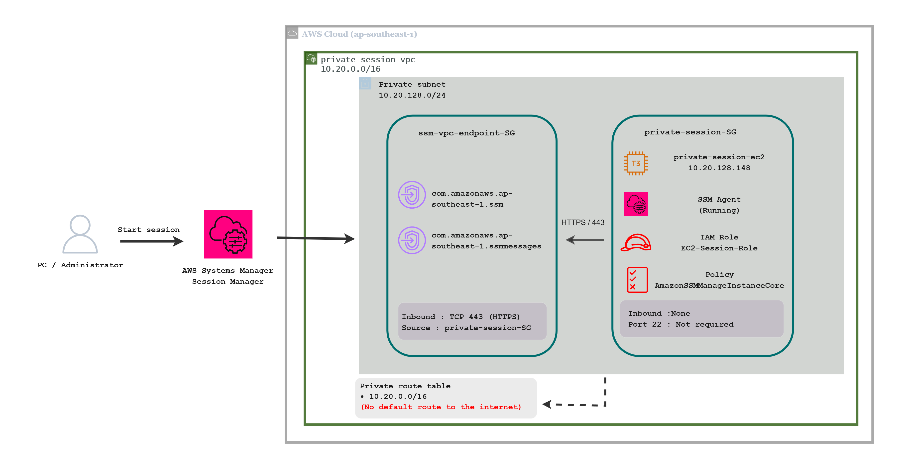

The EC2 instance is located in a Private Subnet and uses an IAM Role with:

```text
EC2-SessionManager-Role
        ↓
AmazonSSMManagedInstanceCore
```

Final security characteristics:

```text
Public IP        → None
Inbound SSH      → None
Bastion Host     → None
NAT Gateway      → None
Session Manager  → Working
```

---

# Phase 1 — Design & Build Private Networking

## Objective

Build the private networking foundation required for the project. The VPC will contain one Public Subnet and one Private Subnet, while the target EC2 instance will later be placed in the Private Subnet.
No NAT Gateway or VPC Interface Endpoint will be created during this phase.

---

> ## Step 1 — Create the VPC

Navigate to:

**AWS Console → VPC → Create VPC**

Select:

**VPC and more**

Use the following configuration:

```text
VPC Name:
private-session-manager-vpc

IPv4 CIDR:
10.20.0.0/16

Availability Zones:
1

Public Subnets:
0

Private Subnets:
1

NAT Gateways:
None

VPC Endpoints:
None
```

The resulting VPC structure is:

```text
private-session-manager-vpc
│
└── Private Subnet
```

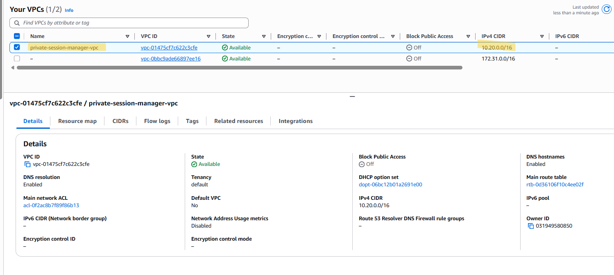

---

> ## Step 2 — Verify the VPC Resource Map

Navigate to:

**VPC → Your VPCs → `private-session-manager-vpc` → Resource map**

Verify that the VPC contains:

```text
VPC
│
└── Private Subnet
```

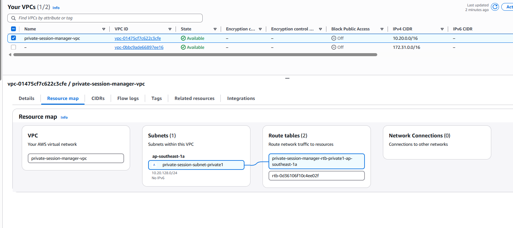

---

> ## Step 3 — Verify the Private Route Table

Select the route table associated with the Private Subnet.  
At this stage, the private route table should contain only the local VPC route:

```text
Destination:
10.20.0.0/16

Target:
local
```

There should be **no**:

```text
0.0.0.0/0 → Internet Gateway
```

and there is intentionally no NAT Gateway route.

The routing model is:

```text
Private Subnet
      ↓
Private Route Table
      ↓
10.20.0.0/16
      ↓
local VPC routing
```

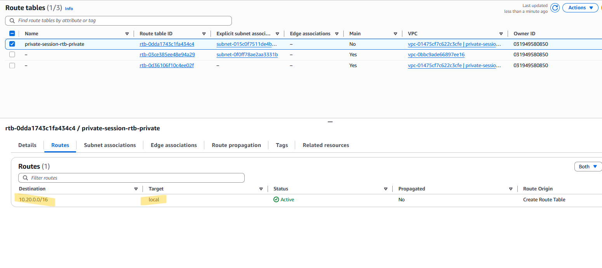

---

> ## Step 4 — Verify Subnet Associations

For the Private Route Table, verify:

```text
Private Route Table
      ↓
Private Subnet
```

This confirms that subnet is using the intended routing table.

---

## Expected Result

At the end of Phase 1, the network foundation should look like:

```text
VPC
│
└── Private Subnet
      └── Private Route Table
             └── 10.20.0.0/16 → local
```

And:

```text
NAT Gateway      → None
VPC Endpoints    → None
Private EC2      → Not created yet
```

The Private Subnet is therefore isolated from direct internet routing.

---

## Phase 1 Key Lesson

A **Private Subnet is not made private simply because it has a different name**.

Its routing determines whether it has a direct path to the internet.

In this project:

```text
Private Subnet
No default internet route
```

This network foundation will later allow us to demonstrate how a private EC2 instance can still communicate with AWS Systems Manager through **VPC Interface Endpoints**, without requiring general internet access.

# Phase 2 — Create Private EC2

## Objective

Launch an Amazon EC2 instance inside the Private Subnet created in Phase 1.

The instance will be intentionally configured **without**:

* A Public IP address
* An SSH key pair
* Inbound SSH access

The purpose is to create the private server environment before configuring Systems Manager connectivity in Phase 3.

---

> ## Step 1 — Launch an EC2 Instance

Navigate to:

**AWS Console → EC2 → Instances → Launch instance**

Set the instance name to:

```text id="6jv3ts"
private-session-ec2
```

---

> ## Step 2 — Select the AMI

Under **Application and OS Images (AMI)**, select:

```text id="uyv7s2"
Amazon Linux 2023
```

Use:

```text id="1b4xv8"
64-bit (x86)
```

Amazon Linux 2023 will be used as the operating system for the private EC2 instance.

---

> ## Step 3 — Select the Instance Type

Use:

```text id="f7c3p1"
t3.micro
```

The project does not require significant compute resources.

---

> ## Step 4 — Do Not Create an SSH Key Pair

Under **Key pair (login)**, select:

```text id="t0k7mx"
Proceed without a key pair
```

No `.pem` file will be created.

This is intentional because the EC2 instance will later be accessed through Session Manager instead of direct SSH.

### Expected Configuration

```text id="8q3fcz"
SSH Key Pair
→ None
```

---

> ## Step 5 — Configure Network Settings

Under **Network settings**, configure the EC2 instance to use the custom VPC created in Phase 1.

### VPC

Select:

```text id="x8q3m6"
private-session-manager-vpc
```

### Subnet

Select:

```text id="m4c9t2"
private-session-subnet-private1
```

This places the EC2 instance inside the Private Subnet.

### Auto-assign Public IP

Set:

```text id="r5v7p1"
Disable
```

The instance should therefore receive only a private IPv4 address.

Expected:

```text id="3k8f2n"
Public IPv4:
None
```

---

> ## Step 6 — Create the EC2 Security Group

Create a dedicated Security Group for the private EC2.

Suggested name:

```text id="p8s4n2"
private-session-SG
```

Description:

```text id="n5q7c3"
private-session-SG for private EC2
```

### Inbound Rules

Do not add any inbound rules.

Expected:

```text id="x9w2k5"
Inbound:
None
```

Do not add:

```text id="q3m6v8"
SSH
TCP 22
```

The EC2 instance will later communicate outward to VPC Interface Endpoints.

### Outbound Rules

For now, keep:

```text id="e7x4p9"
All traffic
0.0.0.0/0
Allow
```

We will refine the overall connectivity architecture in Phase 3.  
This is important because the absence of inbound SSH is part of the final security posture.

---

## — Leave the IAM Instance Profile Empty

## — Leave User Data Empty

## — Use Default Storage

---

> ## Step 7 — Launch the Instance

Click:

**Launch instance**

Wait until the instance reaches:

```text id="q6v3m8"
Instance State:
Running
```

and:

```text id="p2x7k4"
Status Checks:
3/3 passed
```

---

> ## Step 8 — Verify the Final EC2 Placement

Open the EC2 instance details.

Verify:

### Private IPv4

The instance has a private address, for example:

```text id="x8m2q6"
10.20.128.248
```

### Public IPv4

Expected:

```text id="c4v7n9"
-
```

### Subnet

Expected:

```text id="y5k3p8"
private-session-subnet-private1
```

### IAM Role

Expected at this stage:

```text id="h6m9q2"
-
```

This is intentional because IAM configuration belongs to Phase 3.

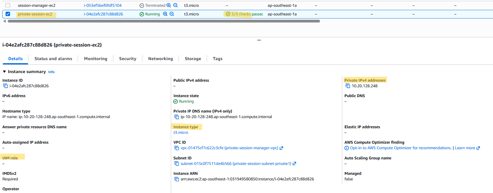
---
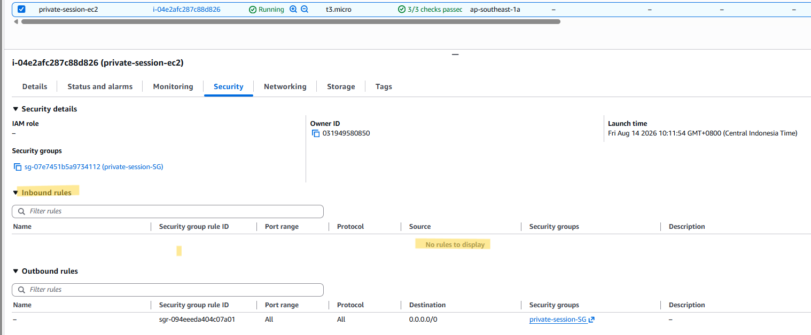

---

## Expected Result

At the end of Phase 2:

```text id="p2m8x4"
private-session-ec2
│
├── Private Subnet ✅
├── Private IPv4 ✅
├── Public IP ❌
├── SSH Key Pair ❌
├── Inbound SSH ❌
├── IAM Role ❌
└── Systems Manager Connectivity ❌
```

The EC2 instance is now a private server.

The next phase will configure the components required for Systems Manager connectivity:

```text id="q7v3m1"
IAM Role
     +
SSM Agent
     +
VPC Interface Endpoints
```

---

## Phase 2 Key Lesson

A private EC2 instance can be created without a Public IP, without an SSH key pair, and without inbound SSH access.

However, removing direct access creates a new requirement:

> **The instance still needs a secure method to communicate with the AWS services required for management.**

That connectivity will be configured in Phase 3.

# Phase 3 — IAM & Systems Manager Connectivity

## Objective

Configure the IAM permissions and private network connectivity required for the EC2 instance to communicate with AWS Systems Manager.

The following components will be configured:

* IAM Role
* `AmazonSSMManagedInstanceCore`
* VPC Interface Endpoint for `ssm`
* VPC Interface Endpoint for `ssmmessages`
* Endpoint Security Group
* Private DNS

The final connectivity path will be:

```text
Private EC2
     │
     │ HTTPS / TCP 443
     ↓
vpc-endpoints-SG
 ├── SSM
 └── SSMMessages
     ↓
AWS Systems Manager
```

---

> ## Step 1 — Create the IAM Role

Navigate to:

**AWS Console → IAM → Roles → Create role**

Under **Trusted entity type**, select:

```text
AWS service
```

For the use case, select:

```text
EC2
```

Click **Next**.

---

> ## Step 2 — Attach `AmazonSSMManagedInstanceCore`

Search for:

```
AmazonSSMManagedInstanceCore
```

Select the policy.

This managed policy provides the core permissions required for an EC2 instance to communicate with Systems Manager.

Click **Next**.

---

> ## Step 3 — Create the IAM Role

Use:

```text
Role name:
EC2-SessionManager-Role
```

Create the role.

The relationship is:

```text
EC2
 ↓
EC2-SessionManager-Role
 ↓
AmazonSSMManagedInstanceCore
```
---
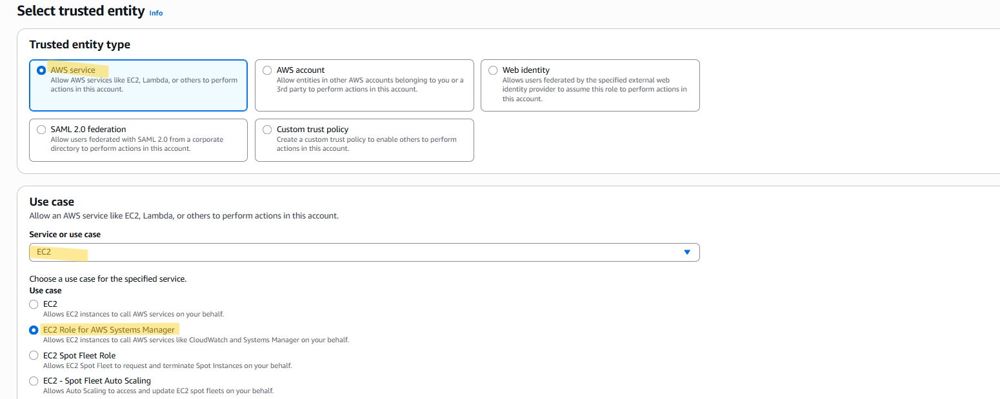
---
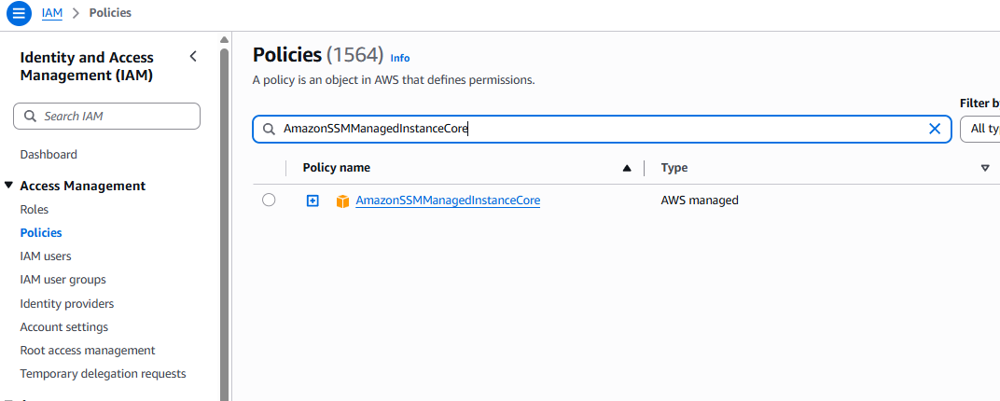

---

> ## Step 4 — Attach the IAM Role to the Private EC2

Navigate to:

**EC2 → Instances → `private-session-ec2`**

Select:

**Actions → Security → Modify IAM role**

Choose:

```text
EC2-SessionManager-Role
```

Click **Update IAM role**.

Return to the EC2 details page and verify:

```text
IAM Role:
EC2-SessionManager-Role
```
---
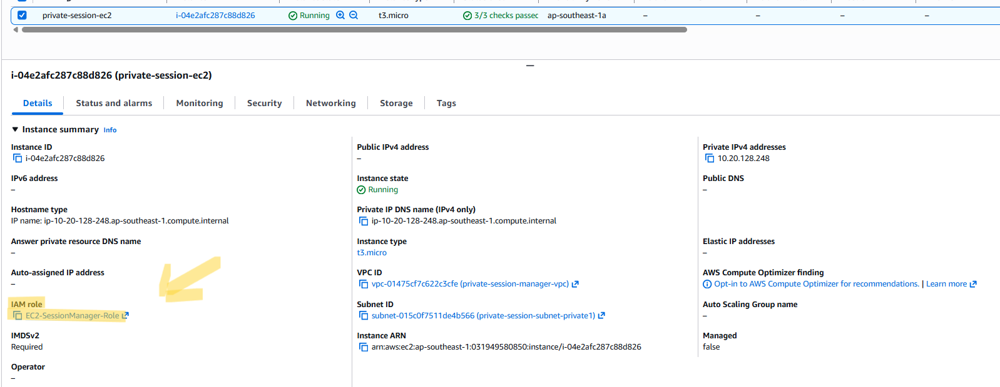

---

> ## Step 5 — Create the VPC Endpoint Security Group

Navigate to:

**EC2 → Security Groups → Create security group**

Use:

```text
Name:
ssm-vpc-endpoint-sg
```

Select:

```text
VPC:
private-session-manager-vpc
```

### Inbound Rule

Add:

```text
Type:
HTTPS

Protocol:
TCP

Port:
443

Source:
private-session-SG
```

This allows the private EC2 instance to access the interface endpoints over HTTPS.

Do not use:

```text
0.0.0.0/0
```

The endpoint should only accept HTTPS connections from the Security Group associated with the private EC2.

---
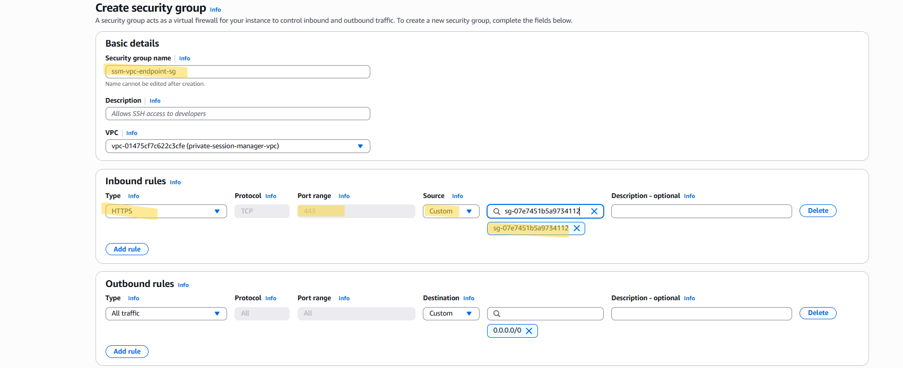

### Outbound

Keep:

```text
All traffic
0.0.0.0/0
```
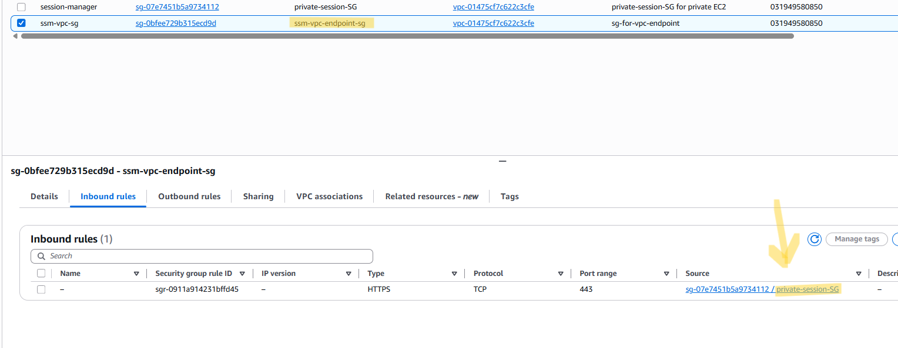

---

> ## Step 6 — Create the `ssm` Interface Endpoint

Navigate to:

**VPC → Endpoints → Create endpoint**

### Service Category

Select:

```text
AWS services
```

Search for:

```text
com.amazonaws.ap-southeast-1.ssm
```

### VPC

Select:

```text
private-session-manager-vpc
```

### Subnet

Select the Private Subnet:

```text
private-session-subnet-private1
```

### Security Group

Select:

```text
ssm-vpc-endpoint-sg
```

### Private DNS

Keep:

```text
Enable DNS name
```

enabled.

### Endpoint Policy

Keep:

```text
Full access
```

For this lab, the endpoint policy is left at the default so the project can focus on the network and IAM controls.

Create the endpoint.

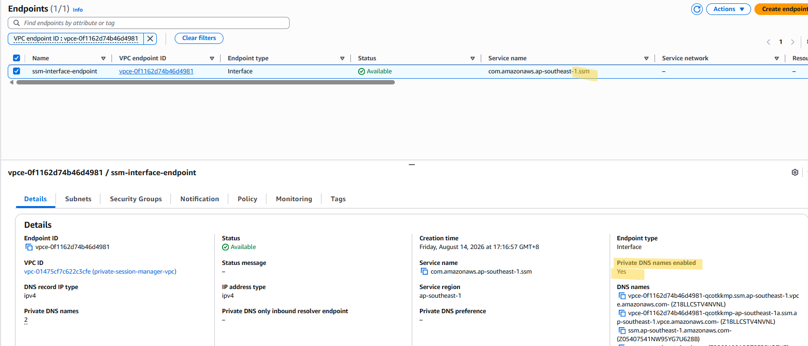

> ## Step 7 — Create the `ssmmessages` Interface Endpoint

Create a second interface endpoint using:

```text
Service:
com.amazonaws.ap-southeast-1.ssmmessages
```

Use the same:

```text
Endpoint Type:
Interface

VPC:
private-session-manager-vpc

Subnet:
private-session-subnet-private1

Security Group:
ssm-vpc-endpoint-sg

Private DNS:
Enabled

Policy:
Full access
```

Create the endpoint.

The `ssmmessages` endpoint is used by SSM Agent for Systems Manager message and Session Manager communication.

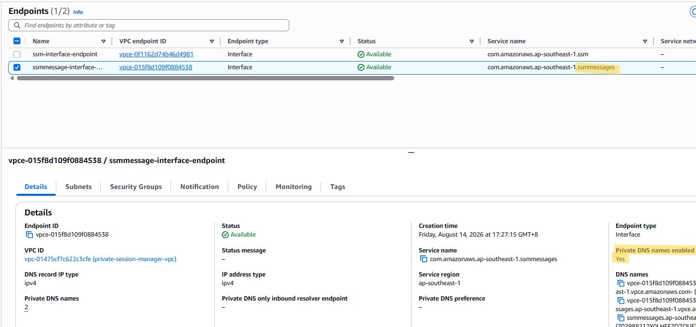

---

## Expected Result

At the end of Phase 3:

```text
Private EC2
│
├── IAM Role
│   └── EC2-SessionManager-Role
│       └── AmazonSSMManagedInstanceCore
│
├── Private IP
├── No Public IP
└── No Inbound SSH
        │
        │ HTTPS / TCP 443
        ↓
VPC Interface Endpoints
├── SSM
└── SSMMessages
        │
        ↓
AWS Systems Manager
```

The endpoint Security Group allows:

```text
HTTPS / TCP 443
Source:
private-session-SG
```

Both interface endpoints should be:

```text
Available
```

At this stage, the network and IAM configuration required for Systems Manager connectivity are complete.

---

## Phase 3 Key Lesson

A private EC2 instance does not need general internet access to communicate with AWS Systems Manager.

Instead, the instance can use:

```text
IAM Role
+
SSM Agent
+
VPC Interface Endpoints
+
HTTPS / TCP 443
```

to establish private connectivity with Systems Manager.

The next phase will verify whether these components actually allow the private EC2 instance to register as an **Online managed node**.

# Phase 4 — Verify Managed Node

## Objective

Verify that the private EC2 instance has successfully registered with AWS Systems Manager as a managed node.

This phase validates that the following components are working together:

* IAM Role
* `AmazonSSMManagedInstanceCore`
* SSM Agent
* VPC Interface Endpoint for `ssm`
* VPC Interface Endpoint for `ssmmessages`
* Endpoint Security Group
* Private DNS

---

> ## Step 1 — Open Session Manager

Navigate to:

**AWS Console → Systems Manager → Session Manager → Start a session**

Refresh the target instance list.

---

> ## Step 2 — Locate the Private EC2

Find:

```text id="r7j2k9"
private-session-ec2
```

The instance should appear as an available managed node.

---

> ## Step 3 — Verify Node Status

Check the status of the instance.

Expected:

```text id="b3m8q4"
Node State:
Running
```

and:

```text id="v6n2p8"
Ping Status:
Online
```

This indicates that Systems Manager can communicate with the private EC2 instance.

---

> ## Step 4 — Understand What Has Been Verified

An Online managed node at this stage means the configuration from Phase 3 is functioning across several layers:

```text id="x5k9m2"
Private EC2
      │
      ├── IAM Role ✅
      │
      ├── SSM Agent ✅
      │
      └── HTTPS / TCP 443
              ↓
      VPC Interface Endpoints
          ├── SSM
          └── SSMMessages
              ↓
      AWS Systems Manager
```

The instance is still:

```text id="j4q7n1"
Public IP:
None

Inbound SSH:
None
```

Yet Systems Manager can communicate with it.

---

> ## Step 5 — Do Not Start the Session Yet

Do not click **Start session** during this phase.

The purpose of Phase 4 is only to confirm that the private EC2 is an online managed node.

The actual shell access test will be performed in Phase 5.

---

## Expected Result

The private EC2 instance should appear as:

```text id="m8x2q5"
private-session-ec2

Node State:
Running

Ping Status:
Online
```

This confirms that the private networking and Systems Manager configuration are working as expected.

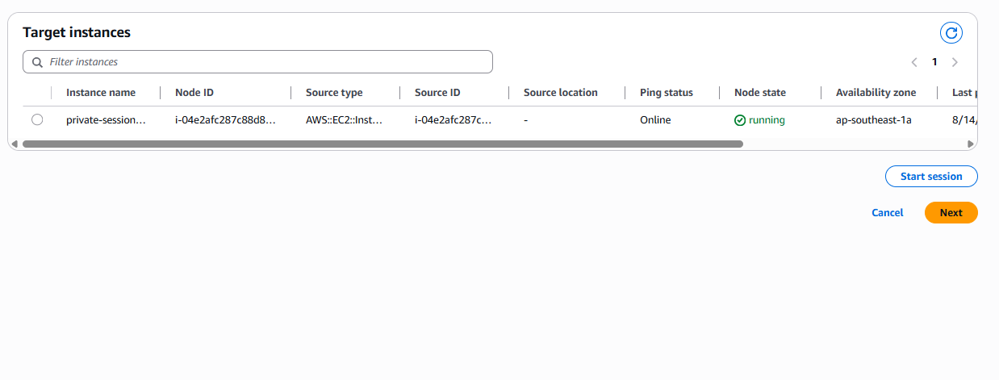

---

## Key Lesson

A private EC2 instance does not need a Public IP or inbound SSH access to become an AWS Systems Manager managed node.

The successful `Online` status demonstrates that the required IAM permissions, SSM Agent, DNS, and private endpoint connectivity are functioning together.

# Phase 5 — Connect to Private EC2

## Objective

Establish an interactive shell session to the private EC2 instance using AWS Systems Manager Session Manager.

The purpose of this phase is to prove that the EC2 instance can be administered even though it has:

* No Public IP
* No inbound SSH access
* No Bastion Host
* No NAT Gateway
* No general internet access

---

> ## Step 1 — Start a Session

Navigate to:

**AWS Console → Systems Manager → Session Manager → Start a session**

Select:

```text id="q3f8m1"
private-session-ec2
```

Verify:

```text id="t7x4p9"
Node State:
Running

Ping Status:
Online
```

Click:

**Start session**

A terminal should open in the browser.

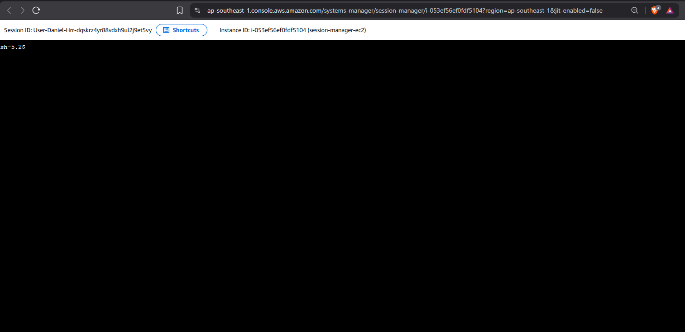
---

> ## Step 2 — Verify the Current User

Inside the Session Manager terminal, run:

```bash id="c5v8n2"
whoami
```

Expected output:

```text id="m7q3x9"
ssm-user
```

This confirms that the interactive shell is being provided through Session Manager.

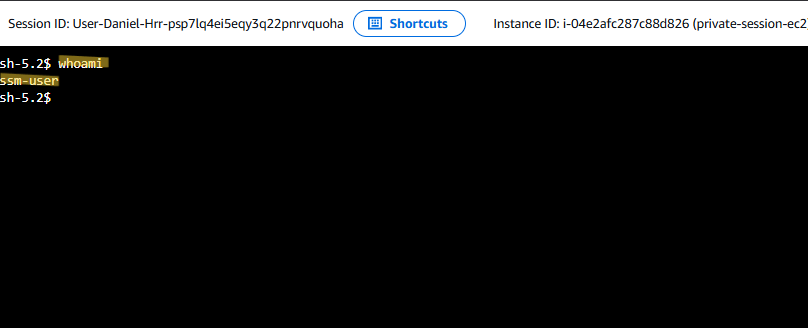
---

> ## Step 3 — Verify the EC2 Hostname

Run:

```bash id="r7k3m5"
hostname
```

The command should return the hostname of the private EC2 instance.  
This confirms that the session is connected to the intended EC2 target.

---

> ## Step 4 — Verify the Private IP Address

Run:

```bash id="n4v7c2"
ip addr
```

Locate the primary interface and confirm that the instance has a private IPv4 address.

For this project, the EC2 instance uses:

```text id="j8m3q5"
10.20.128.248
```

There should be no Public IPv4 address associated with the instance.

This demonstrates that Session Manager is providing access to a genuinely private EC2 instance.

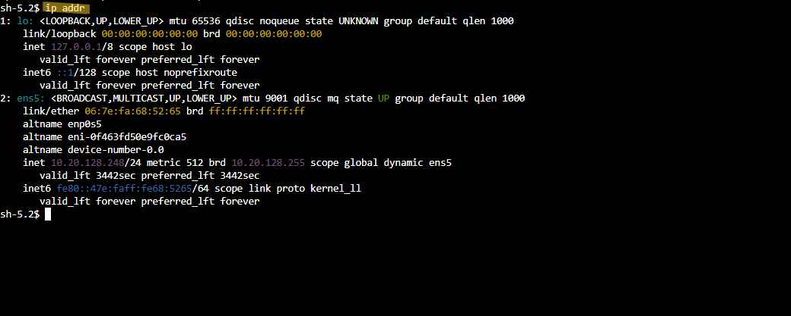
---

> ## Step 5 — Verify SSH Exposure

Run:

```bash id="v8q2m4"
sudo ss -tulnp
```

Check whether TCP port 22 is listening.

The SSH daemon may still be running inside the operating system.

If you see:

```text id="w5n3k7"
0.0.0.0:22
[::]:22
```

this means SSH is listening locally.

However, this does **not** mean the EC2 instance is remotely accessible through SSH.

The Security Group still has:

```text id="s4m8x2"
Inbound:
None
```

Therefore:

```text id="g6p3q9"
SSH service        → May be running
Inbound SSH        → None
Public IP          → None
Session Manager    → Working
```

This reinforces the networking concept demonstrated in Project 1:

> A service listening on a port does not automatically mean that the port is reachable from the network.

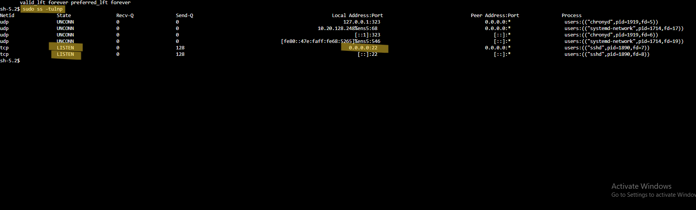
---

> ## Step 6 — Execute a Test Command

Run:

```bash id="c8m2v5"
echo "Connected to private EC2 through AWS Systems Manager Session Manager"
```

Expected output:

```text id="r6x9k3"
Connected to private EC2 through AWS Systems Manager Session Manager
```

This confirms that commands can be executed successfully on the private EC2 instance.

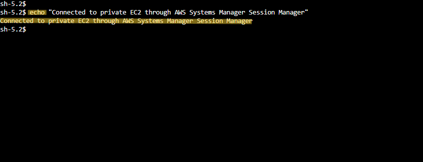
---

## Step 7 — Confirm the Access Path

The successful session demonstrates the following path:

```text id="x4v9m2"
Administrator
      │
      │ IAM
      ↓
AWS Systems Manager
      │
      │ Session Manager
      ↓
VPC Interface Endpoints
      │
      │ HTTPS / TCP 443
      ↓
SSM Agent
      │
      ↓
Private EC2
```

The EC2 instance remains:

```text id="m8q3v7"
Public IP       → None
Inbound SSH     → None
Bastion Host    → None
```

Yet interactive shell access is available.

---

## Expected Result

The private EC2 instance is successfully accessible through Session Manager while remaining private.

```text id="p7x4m2"
Private Subnet       ✅
Private IP           ✅
Public IP            ❌
Inbound SSH          ❌
Bastion Host         ❌
Session Manager      ✅
Shell Access         ✅
```

This proves that the VPC Interface Endpoints provide the private connectivity required for Systems Manager access.

---

## Key Lesson

A private EC2 instance can be administered through Session Manager without requiring:

```text
Public IP
Inbound SSH
Bastion Host
NAT Gateway
General Internet Access
```

The private connectivity required by Session Manager is provided through the VPC Interface Endpoints and the SSM Agent.

The next phase will introduce a controlled network failure and investigate why a new Session Manager session fails when the endpoint Security Group no longer allows TCP 443.

# Phase 6 — Troubleshooting Session Manager Connectivity

## Objective

Simulate a realistic connectivity failure and troubleshoot why a new AWS Systems Manager Session Manager session cannot be established.

The troubleshooting scenario focuses on the Security Group attached to the VPC Interface Endpoints.  
The troubleshooting process follows:

```text
Problem
   ↓
Investigation
   ↓
Root Cause
   ↓
Remediation
   ↓
Verification
```

---

## Step 1 — Establish a Working Baseline

Before introducing the failure, verify that Session Manager is currently working.

Navigate to:

**AWS Systems Manager → Session Manager → Start a session**

Select:

```text id="s4q8v2"
private-session-ec2
```

Start a new session and confirm that the terminal opens successfully.  
This provides a known-good baseline before making any configuration changes.

### Expected Result

```text id="w7m3x9"
Session Manager → Working ✅
```

---

## Step 2 — Introduce a Controlled Failure

Navigate to:

**EC2 → Security Groups → `ssm-vpc-endpoint-sg`**

Edit the inbound rules.

Remove the existing rule:

```text id="q6x2m8"
Type:
HTTPS

Protocol:
TCP

Port:
443

Source:
private-session-SG
```

The endpoint Security Group should temporarily have:

```text id="x8m4n2"
Inbound:
None
```

This intentionally prevents the private EC2 instance from reaching the VPC Interface Endpoint over TCP 443.

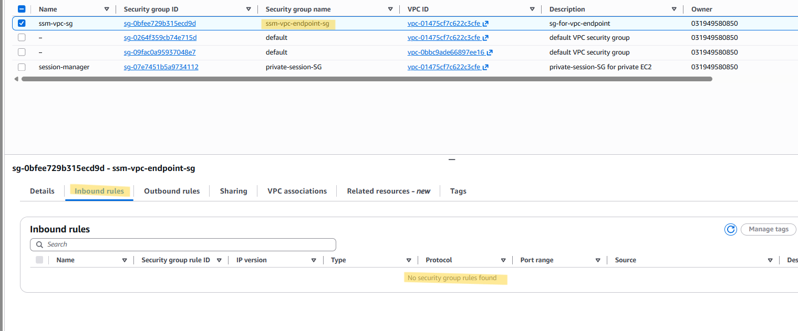
---

## Step 3 — Test a New Session

Return to:

**Systems Manager → Session Manager → Start a session**

Select:

```text id="n4x8p2"
private-session-ec2
```

Attempt to start a **new session**.

The node may still show:

```text id="m8q3v7"
Node State:
Running

Ping Status:
Online
```

However, the new session should fail.

The existing managed-node status does not guarantee that a new Session Manager channel can be established.

### Expected Result

```text id="r7m2x5"
Managed Node:
Online ✅

New Session:
Failed ❌
```
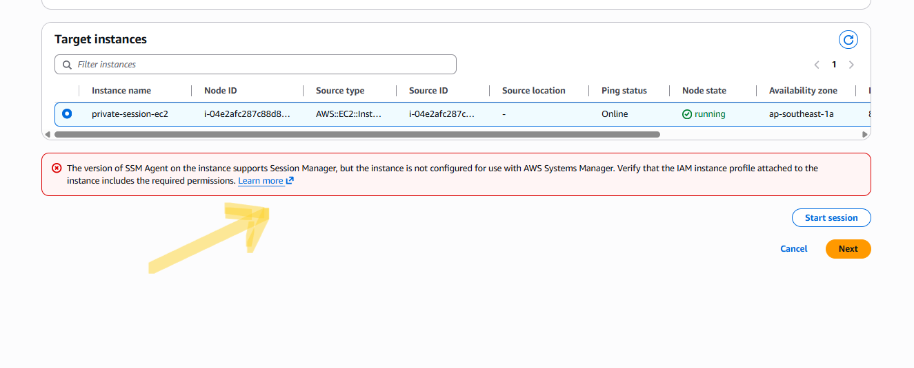
---

# Investigation

## Step 4 — Check the IAM Role

Navigate to:

**IAM → Roles → `EC2-SessionManager-Role`**

Verify that:

```text id="k9m3x6"
AmazonSSMManagedInstanceCore
```

is still attached.

The IAM configuration has not been modified, so the role should remain correct.

### Result

```text id="h4q7v2"
IAM Role:
Correct ✅
```

---

> ## Step 5 — Check the VPC Interface Endpoints

Navigate to:

**VPC → Endpoints**

Verify:

```text id="s8q4m1"
com.amazonaws.ap-southeast-1.ssm
→ Available

com.amazonaws.ap-southeast-1.ssmmessages
→ Available
```

The endpoints themselves are still healthy.

### Result

```text id="p7x3n5"
SSM Endpoint:
Available ✅

SSMMessages Endpoint:
Available ✅
```

This eliminates the endpoints themselves as the primary cause.

---

> ## Step 6 — Check the Endpoint Security Group

Navigate to:

**EC2 → Security Groups → `ssm-vpc-endpoint-sg`**

Review the inbound rules.  
The current state is:

```text id="v5x2m9"
Inbound Rules:
None
```

Compare this with the original configuration:

```text id="n8q4c3"
HTTPS
TCP 443
Source:
private-session-SG
```

The missing HTTPS/443 rule is the only relevant configuration change introduced in this troubleshooting scenario.

### Root Cause Identified

The VPC Interface Endpoint Security Group is blocking the private EC2 instance from establishing the required HTTPS/TCP 443 connection.

The resulting path is:

```text id="k6m2x8"
Private EC2
      │
      │ TCP 443
      ✕
VPC Interface Endpoint
      │
      ↓
Systems Manager
```

---

## Remediation

> ## Step 7 — Restore HTTPS/443

Return to:

**EC2 → Security Groups → `ssm-vpc-endpoint-sg` → Inbound rules**

Add the original rule:

```text id="m3x8q2"
Type:
HTTPS

Protocol:
TCP

Port:
443

Source:
private-session-SG
```

Do not use:

```text id="f2n6v9"
0.0.0.0/0
```

The endpoint should only accept HTTPS traffic from the Security Group used by the private EC2.

### Result

```text id="y7q2m8"
HTTPS / TCP 443
Source: private-session-SG
→ Restored ✅
```

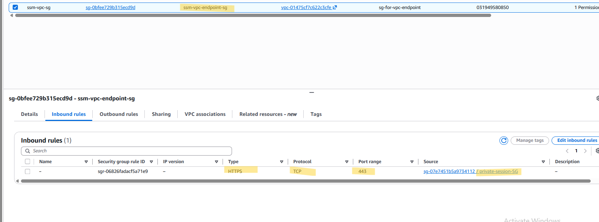
---

## Verification

> ## Step 8 — Start a New Session Again

Return to:

**Systems Manager → Session Manager → Start a session**

Select:

```text id="u6q3m9"
private-session-ec2
```

Start a new session.

The Session Manager connection should now succeed.

### Expected Result

```text id="c8m2x5"
Session Manager:
Working ✅
```

---

# Troubleshooting Summary

The complete troubleshooting process was:

```text id="w5m2x8"
Session Manager New Session Failed
            ↓
      Check IAM Role
            ↓
          Correct ✅
            ↓
     Check VPC Endpoints
            ↓
          Available ✅
            ↓
  Check Endpoint Security Group
            ↓
     TCP 443 Rule Missing ❌
            ↓
        Root Cause Found
            ↓
    Restore HTTPS / TCP 443
            ↓
       Start New Session
            ↓
         Success ✅
```

---

## Root Cause

The Session Manager connection failed because the Security Group attached to the VPC Interface Endpoints did not allow inbound **HTTPS/TCP 443** traffic from the Security Group attached to the private EC2 instance.

---

## Remediation

The following rule was restored:

```text id="d7q3m8"
HTTPS
TCP 443
Source: private-session-SG
```

The new Session Manager session then succeeded.

---

## Key Lesson

A VPC Interface Endpoint can be **Available** while still being unreachable by the EC2 instance.

Both conditions must be satisfied:

```text id="q4m8x2"
Endpoint
→ Available ✅

Endpoint Security Group
→ Allows TCP 443 from EC2 ✅
```

This troubleshooting exercise demonstrated that AWS networking problems should be investigated layer by layer instead of assuming that a healthy managed-node status means every Session Manager connection path is working.

# Project Outcome

This project successfully demonstrated how to securely administer an Amazon EC2 instance located in a Private Subnet using AWS Systems Manager Session Manager.

The EC2 instance remained private throughout the project while still providing interactive shell access through Session Manager.

The final architecture achieved:

```text id="8k3m6x"
Private Subnet             ✅
Private IP                 ✅
Public IP                  ❌
Inbound SSH                ❌
Bastion Host               ❌
NAT Gateway                ❌
General Internet Access    ❌
IAM Role                   ✅
SSM Agent                  ✅
SSM Interface Endpoint     ✅
SSMMessages Endpoint       ✅
Session Manager            ✅
```

The project also demonstrated that private EC2 administration does not require direct internet connectivity when the required AWS service connectivity is provided through VPC Interface Endpoints.

---

# Troubleshooting Summary

A controlled connectivity failure was introduced by removing the HTTPS/TCP 443 inbound rule from the Security Group attached to the VPC Interface Endpoints.

### Problem

A new Session Manager session could not be established.

```text id="n6q2v8"
Managed Node:
Online ✅

New Session:
Failed ❌
```

### Investigation

The following components were checked:

```text id="7m3xq9"
IAM Role                → Correct ✅
SSM Endpoint             → Available ✅
SSMMessages Endpoint     → Available ✅
Endpoint Security Group  → TCP 443 missing ❌
```

### Root Cause

The VPC Interface Endpoint Security Group was not allowing HTTPS/TCP 443 traffic from the private EC2 Security Group.

### Remediation

The following rule was restored:

```text id="q8m4x2"
Type:
HTTPS

Protocol:
TCP

Port:
443

Source:
private-session-SG
```

### Verification

A new Session Manager session was successfully established after the rule was restored.

```text id="c3m8x7"
Session Manager:
Working ✅
```

This demonstrated that the endpoint Security Group was the root cause of the connectivity failure.

---

# Key Lessons

### 1. Private EC2 does not require a Public IP for Session Manager

An EC2 instance can remain inside a Private Subnet and still be managed through Systems Manager.

### 2. Session Manager and internet access are different concepts

The private EC2 instance successfully used Session Manager even though it did not have general internet access.

### 3. VPC Interface Endpoints provide private AWS service connectivity

The `ssm` and `ssmmessages` endpoints allowed the SSM Agent to communicate with Systems Manager without requiring a NAT Gateway.

### 4. Security Groups can affect VPC Endpoint connectivity

A VPC Interface Endpoint being `Available` does not automatically mean that every EC2 instance can use it.

The endpoint Security Group must allow the required traffic.

### 5. Endpoint access should be restricted

Instead of allowing:

```text id="f1m7x3"
TCP 443
Source: 0.0.0.0/0
```

the project used:

```text id="x5m8q2"
TCP 443
Source: private-session-SG
```

This follows the principle of limiting access to the resources that actually need it.

### 6. Managed Node status does not guarantee a new session will succeed

The instance remained `Online` during the troubleshooting scenario even though a new Session Manager session failed.

This reinforced the importance of checking the complete connectivity path rather than relying on managed-node status alone.

---

# Project Outcome

Through this project, I practiced:

* Designing a Private Subnet architecture
* Creating and managing EC2 instances without Public IPs
* Using IAM Roles for Systems Manager
* Configuring VPC Interface Endpoints
* Understanding `ssm` and `ssmmessages`
* Controlling endpoint access with Security Groups
* Using Session Manager for private EC2 administration
* Troubleshooting AWS networking and connectivity issues
* Applying least-privilege principles to service access

The project strengthened my understanding of how **networking, IAM, and secure administrative access work together in AWS Cloud Security**.
